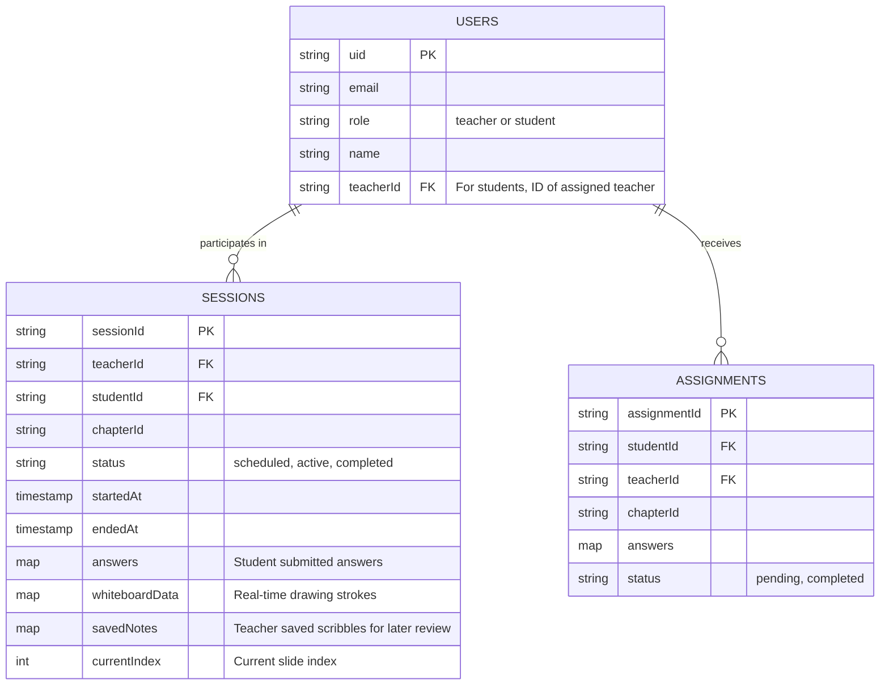

# SAT Tutoring Platform Architecture Plan

## Overview
The platform is being redesigned to support 1-to-1 SAT tutoring sessions with dedicated student and teacher accounts. The core experience centers around a unified, slide-based presentation format that follows a strict pedagogical flow (Diagnostic -> Theory with Whiteboard -> Practice Questions).

## Data Architecture (Firestore)



## Presentation Flow & Teacher Tools

The lesson presentation will follow this sequence structure, augmented by a rich Teacher Toolbar:

```mermaid
graph TD
    Start[Start Session] --> Diag[Lesson Diagnostic Test<br/>3-4 Questions]
    
    Diag --> Sub1_Theory[Subtopic 1: Theory Slide]
    Sub1_Theory --> Sub1_Q[Subtopic 1: Practice Questions]
    
    Sub1_Q --> Sub2_Theory[Subtopic 2: Theory Slide]
    Sub2_Theory --> Sub2_Q[Subtopic 2: Practice Questions]
    
    Sub2_Q --> End[Session Complete]
    
    subgraph Teacher Tools (Available on all slides)
        W[Whiteboard Scribble]
        V[Math Visualization<br/>e.g. Desmos]
        S[Save Notes to DB]
    end
    Sub1_Theory -.-> Teacher Tools
    Sub2_Theory -.-> Teacher Tools
```

## Implementation Steps
1. **User Roles & Auth**: Add `role` to Firebase users. Route logins to either Teacher or Student dashboards.
2. **Student Dashboard**: A new view for students to see their assigned teacher, past lessons (with saved notes), complete homework assignments, and join active sessions.
3. **Homework Integration**: Add logic to assign and track async homework assignments independent of live sessions.
4. **Data Refactor**: Update `satCurriculum.js` and DB fetching to support the new Lesson -> Subtopics structure.
5. **Session Sequencing**: Modify `SATTeacherDashboard.jsx` to construct the presentation flow exactly as requested.
6. **Presentation UI**: Unify the viewer. Add left/right keyboard navigation and on-screen arrows.
7. **Teacher Toolbar & Visualization**: Implement a toolbar for the teacher containing buttons for math visualization tools (like Desmos) and whiteboard activation.
8. **Whiteboard & Note Saving**: Implement an HTML canvas for freehand scribbling. Sync stroke data live, and add a "Save Notes" feature that persists the scribbles to Firestore for the student's asynchronous review.
9. **Session Management**: Update session creation to explicitly select a student and save history upon completion.
